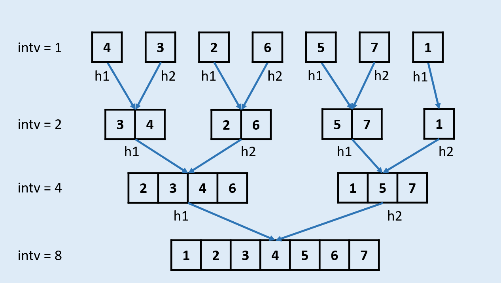

# 归并排序（从底至顶直接合并）

* 对于非递归的归并排序，需要使用迭代的方式替换cut环节：
    + 我们知道，cut环节本质上是通过二分法得到链表最小节点单元，再通过多轮合并得到排序结果。
    + 每一轮合并merge操作针对的单元都有固定长度intv，例如：
    	+ 第一轮合并时intv = 1，即将整个链表切分为多个长度为1的单元，并按顺序两两排序合并，合并完成的已排序单元长度为2。
		+ 第二轮合并时intv = 2，即将整个链表切分为多个长度为2的单元，并按顺序两两排序合并，合并完成已排序单元长度为4。
		+ 以此类推，直到单元长度intv >= 链表长度，代表已经排序完成。
	+ 根据以上推论，我们可以仅根据intv计算每个单元边界，并完成链表的每轮排序合并，例如:
		+ 当intv = 1时，将链表第1和第2节点排序合并，第3和第4节点排序合并，……。
		+ 当intv = 2时，将链表第1-2和第3-4节点排序合并，第5-6和第7-8节点排序合并，……。
		+ 当intv = 4时，将链表第1-4和第5-8节点排序合并，第9-12和第13-16节点排序合并，……。
* 此方法时间复杂度O(nlogn)O(nlogn)，空间复杂度O(1)O(1)。

* 模拟上述的多轮排序合并：
  * 统计链表长度length，用于通过判断intv < length判定是否完成排序；
  * 额外声明一个节点res，作为头部后面接整个链表，用于：
    * intv *= 2即切换到下一轮合并时，可通过res.next找到链表头部h；
    * 执行排序合并时，需要一个辅助节点作为头部，而res则作为链表头部排序合并时的辅助头部pre；后面的合并排序可以将上次合并排序的尾部tail用做辅助节点。
  * 在每轮intv下的合并流程：
    1. 根据intv找到合并单元1和单元2的头部h1, h2。由于链表长度可能不是2^n，需要考虑边界条件：
       + 在找h2过程中，如果链表剩余元素个数少于intv，则无需合并环节，直接break，执行下一轮合并；
       + 若h2存在，但以h2为头部的剩余元素个数少于intv，也执行合并环节，h2单元的长度为c2 = intv - i
    2. 合并长度为c1, c2的h1, h2链表，其中：
      * 合并完后，需要修改新的合并单元的尾部pre指针指向下一个合并单元头部h。（在寻找h1, h2环节中，h指针已经被移动到下一个单元头部）
      * 合并单元尾部同时也作为下次合并的辅助头部pre。
    3. 当h == None，代表此轮intv合并完成，跳出。
    
  * 每轮合并完成后将单元长度×2，切换到下轮合并：intv *= 2。